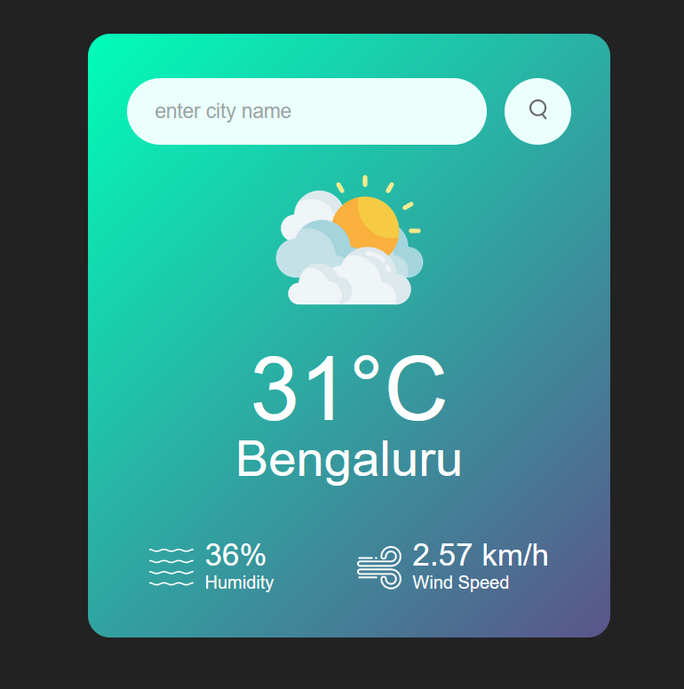
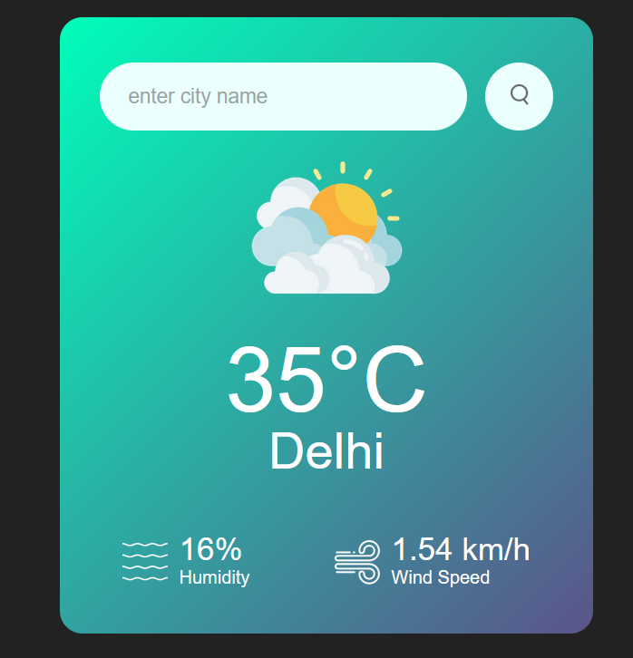

# 🌦️ Weather App

A simple weather app that fetches real-time weather data using the OpenWeather API. Displays temperature, humidity, wind speed, and weather conditions based on the city input.

##  Live Demo  
🔗 [Click here to view the Weather App](https://abhishek-verma01.github.io/Weather-App/)

##  Preview  

##  Features
- Fetches real-time weather data
- Displays temperature, humidity, wind speed & weather icon
- Search any city worldwide

##  Technologies Used
- HTML, CSS, JavaScript
- OpenWeather API

##  How to Use?
1. Enter a city name in the search box.  
2. Click the search button or press **Enter**.  
3. View real-time weather updates!  

